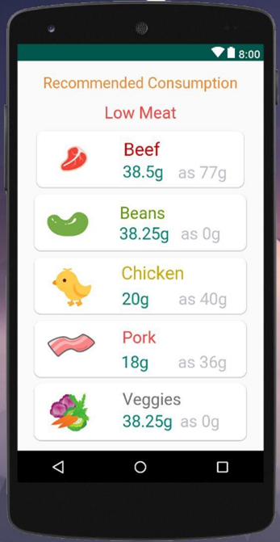

The app will take people’s input of their daily meals. A comparison of this data with the average Canadian is shown so people can see how much of an improvement they are to the standard amount. The app can recommend a change to their diet in a few different ways to reduce their carbon footprint. Another feature is that the app allows people to make pledges for their diet. This is to help people create a goal for themselves and help encourage them to work towards a better diet. The data of other people can be seen so anyone can directly compare their progress with some other person.

